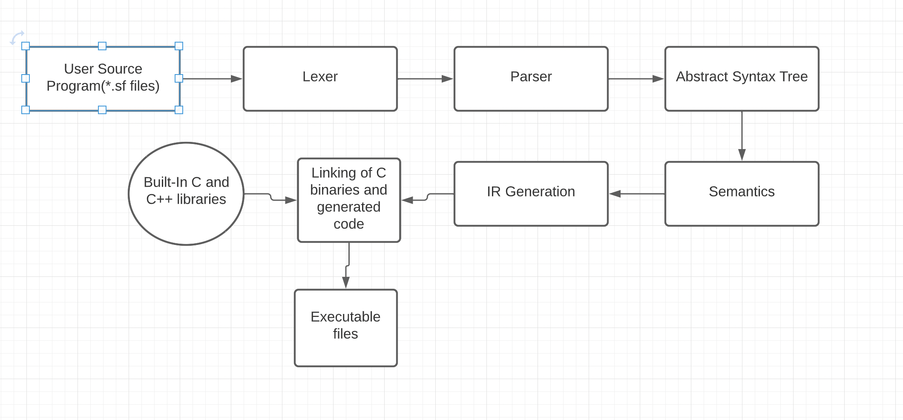
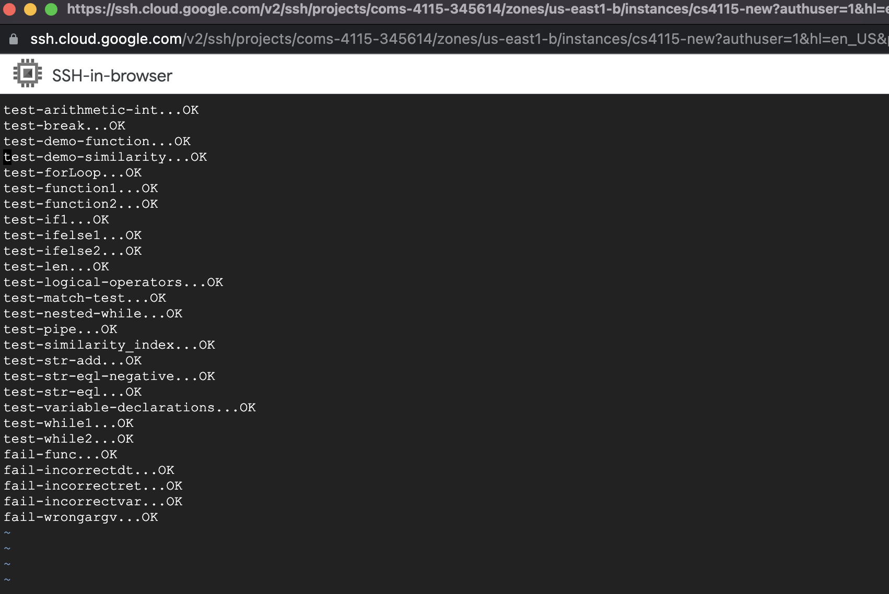

# FINAL REPORT: SIFT 

```
Anne Zepecki (Manager)
Lama Abdullah Rashed (Tester)
Jose Antonio Ramos (Language Guru)
Rishav Kumar (System Architect)
Suryanarayana Venkata Akella (System Architect)
```

<!-- vscode-markdown-toc -->
 1. [Introduction](#Introduction)
 2. [Language Tutorial](#LanguageTutorial)
 3. [Architectural Design](#ArchitecturalDesign)	
 4. [Test Plan](#TestPlan)
 5. [Summary](#Summary)
<!-- vscode-markdown-toc-config
	numbering=true
	autoSave=true
	/vscode-markdown-toc-config -->
<!-- /vscode-markdown-toc -->

##  1. <a name='Introduction'></a>Introduction

Sift is a programming language designed to optimize text processing and filtering for natural language processing (NLP) applications.
Sift draws inspiration from the elegance of C’s syntax while adding its own unique flair. This imperative language is designed for users with some programming experience as knowledge of C or a similar language will allow users to instantly recognize and understand the basic structure of Sift. However, it is the text-specific processing tools that make Sift stand out as the best language to use for NLP purposes; piping, filtering, and basic tokenization functionality give users the tools they need to seamlessly integrate Sift into their existing or future NLP workflows.

##  2. <a name='LanguageTutorial'></a>Language Tutorial

Sift files are signified with the `.sf` extention. The entry point of a sift program is the main function.(Just like C :) )

### Fundamentals 

**Data Types** 

Sift consists of several key primitive data types: `int`, `float`, `char`, `str`, and `bool`. 

__For strings, we also implemented additional string operations since Sift is a language meant for text-processing__.

Example usage with `str_add`: 

```js
def int main() {
  str a = "ap";
  str b = "ple";
  str c = str_add(a, b);
  print(c);
  return 0;
}
```

**Comments**

Comments begin with `/*` and close with `*/`; they cannot be nested and may not appear within literals. Like whitespaces, comments are ignored.

**Identifiers** 

Identifiers are composed of a sequence of letters, digits, and the `_` punctuation. The first character of any identifier must be in the range [a-z A-Z] (cannot be a digit). Upper and lowercase letters are distinct. Identifiers may not have the same value as a keyword.

Variable declaration follows the following syntax: 

```js
int a = 3;
```

**Operators: Arithmetic**

The following arithmetic operators are available: `+`, `-`, `/`, `*`, and `%`. These operators function in the same way as they would in C. 

**Operators: Relational**

The following relational operators are available: `>`, `<`, `==`, `!=`, `<=`, `>=`. These operators function in the same way as they would in C. 

**Operators: Logical**

The following logical operators are available: `&&`, `||`, `!`. These operators function in the same way as they would in C. 

**Control Flow**

The following functionality for control flow is available: 
`if` blocks, `if/else` blocks, `while` loops, `for` loops, `return` keyword, `break` keyword. 

**Function Calls**

In Sift, functions are declared with the keyword `def`. The function should have a name, followed by it's return type, and a consequent block of code to be executed when the function is called.
A function can take zero, one or more arguments and return an expression of a certain type; the retuned type should be declared in the function header. 

**Syntax:**


```js
def int hello() {
    print(“Hello World!”);
    return 0;
}
```

### Sift-Specific Functionality
 
**Pipe Operators**

There is a pipe operator `|>` much like pipe in unix which applies an output of an expression to another expression. Refer to the below test case:

#### Example Syntax

```js
def int func(int a, int b, int c, int d) {
    return a + b + c + d;
}

def int main() {
   print((2 |> func(6, 4, 9)));
   return 0;
}
```
In the above example, 2 is provided as an input to the function func that has only three arguments. This operation can be used for pipelining the various string operations.

**Regular Expressions** 

We have implemented built-in regex functionality as a part of Sift based on Thompson's NFA expressions(https://swtch.com/~rsc/regexp/). There are three regex functionalities supported in test. The regex doesn't support escape characters as of now.

```
bool reg_test(string, regex);
arr<str> reg_match(string, regex);
arr<int> reg_match_indices(string, regex);
```

The reg_test method checks if the string matches the given regex expression with the string provided.

The reg_match method checks for all the instances where the regex expression matches with the string provided. It returns an array of all the words that match with the given regex expression.

The reg_match_indices method checks for all the instances where the regex expression matches with the string provided. It returns an array of starting indices of all the text that match with the given regex expression.

Note: As of now, arrays aren't implemented and thus methods reg_match and reg_match_indices return values are not compatible with the language.

**NLP Features** 

We have two nlp functions currently supported
```
arr<str> word_tokenize(str);
float get_jaro(str1, str2);
```

The word_tokenize method returns an array of strings separated by space.
The get_jaro method calculates the similarity between two strings.(https://rosettacode.org/wiki/Jaro_similarity). The higher the value of get_jaro, more similar the two sentences are.
The similarity value is in the range of 0 to 1.

```js
def int main() {
    print(get_jaro("THOUGHT",    "THROW"));
    print(get_jaro("ANALYZE",     "PARALYZE"));
    print(get_jaro("JELLYFISH", "SMELLYFISH"));
    return 0;
}

```

Note: As of now, arrays aren't implemented and thus methods word_tokenize return values are not compatible with the language.

##  3. <a name='ArchitecturalDesign'></a>Architectural Design 



### SCANNER

_Relevant files_: `scanner.mll`

The scanner file takes a Sift source program and translates the stream of characters into a stream of tokens for identifiers, keywords, operators, literals, etc. At this stage, any whitespace and comments are discarded from the stream of tokens.
The scanner is implemented in Ocamllex, and uses regular expressions for scanning string literals, identifiers, digits and other language constructs. If a token is not identified by the scanner, it will throw an error. The tokens processed by the scanner are passed to the parser for the next step in the pipeline.

_Implemented by_: Rishav, José, Lama, Anne, Surya 

### PARSER AND AST

_Relevant files_: `parser.mly` and `ast.ml`

The parser accepts the tokens generated by the scanner and creates an abstract syntax tree (AST) with the grammar provided in `parser.mly`. The parser enforces a Context Free Grammar (CFG) consisting of productions and their precedence. The parser also defines the entry point of the program. The parser is written in Ocamlyacc. If the syntax of the program is incorrect, then the parser throws a `Stdlib.parse_error`.

The AST defines the token syntax tree and includes binary and unary operators, primitive data types, expression, and constructs of the language.

_Implemented by_: José, Lama, Rishav, Anne, Surya

### SEMANTICS

_Relevant files_: `sast.ml` and `semantics.ml`

The semantic checker converts the AST into a semantically checked syntax tree (SAST). The semantic analysis process performs validation like ensuring that variables are declared and have been declared with valid values. It  maintains the scope of the variables and functions using a symbol table (as Sift is a statically type language). The SAST also validates whether the built-in C functions were provided the correct types or not. Once the semantic checks are completed, an SAST is generated and passed as an input to the IR Generator.

_Implemented by_: José and Lama

### IR GENERATION

_Relevant files_: `irgen.ml`

The IR generator takes an SAST and outputs LLVM code. We use ocaml llvm's library to map expression to LLVM accepted data types. The LLVM code is then compiled from the intermediate representation(IR) to the target machine code. We also define the custom C functions in the irgen.ml as SCall in order to call the custom C functions created.

_Implemented by_: José, Lama, and Rishav

### BUILT-IN LIBRARIES

Irgen interacts with custom c code in the src/c folders. regex.c contains the regex functionalities implementation(Reference: https://swtch.com/~rsc/regexp/). The similarity.c contains implementation of Jaro similarity. sift_func.c contains utility C functions and the custom print function implementations.

_Implemented by_: Rishav and Surya

##  4. <a name='TestPlan'></a>Test Plan

### 4.1 <a name='Example Sift Programs'></a>Test Plan

The following are two programs written in sift that demonstrates different text processing application that developers can do using SIFT.

### Source Programs

**Most similar strings** 

The below program checks the similarity of two strings(shark, jellyfish) to a string(smellyfish). The program uses the nlp functionality, get_jaro, to calculate the similarity between the two strings. Then the value obtained is used to make the decision. The function also demonstrate the use of pipe features which in this case is used to concatenate strings to form an output string.

Sift Source Program:

```
def str get_result_string(str a, str b, str c) {
	str result = str_add(a, " is more similar to ") |> str_add(b) |> str_add(" than ") |> str_add(c);
	return result;
}

def int main() {

	str smellyfish = "SMELLYFISH";
	str jellyfish = "JELLYFISH";
	str apple = "SHARK";

	float smelly_apple = get_jaro(smellyfish, apple);
	float smelly_jelly = get_jaro(smellyfish, jellyfish);

	if (smelly_apple > smelly_jelly) {
		print(get_result_string(apple, smellyfish, jellyfish));
	} else {
		print(get_result_string(jellyfish, smellyfish, apple));
	}
	
    return 0;
}

```

LLVM Target Program:

```
; ModuleID = 'Sift'
source_filename = "Sift"
target datalayout = "e-m:e-p270:32:32-p271:32:32-p272:64:64-i64:64-f80:128-n8:16:32:64-S128"

@str_literal = private unnamed_addr constant [7 x i8] c" than \00", align 1
@str_literal.1 = private unnamed_addr constant [21 x i8] c" is more similar to \00", align 1
@str_literal.2 = private unnamed_addr constant [11 x i8] c"SMELLYFISH\00", align 1
@str_literal.3 = private unnamed_addr constant [10 x i8] c"JELLYFISH\00", align 1
@str_literal.4 = private unnamed_addr constant [6 x i8] c"SHARK\00", align 1

declare i8* @str_add(i8*, i8*)

declare i1 @str_eql(i8*, i8*)

declare i32 @len(i8*)

declare i32 @print_i(i32, ...)

declare i32 @print_d(double, ...)

declare i32 @print_s(i8*, ...)

declare i32 @print_b(i1, ...)

declare i8* @input(i32, ...)

declare i32 @output(i8*, ...)

declare i32 @word_tokenize(i8*)

declare i32 @reg_match(i8*, i8*)

declare i1 @reg_test(i8*, i8*)

declare i32 @match_indices(i8*, i8*)

declare double @get_jaro(i8*, i8*)

define i8* @get_result_string(i8* %a, i8* %b, i8* %c) {
entry:
  %a1 = alloca i8*
  store i8* %a, i8** %a1
  %b2 = alloca i8*
  store i8* %b, i8** %b2
  %c3 = alloca i8*
  store i8* %c, i8** %c3
  %c4 = load i8*, i8** %c3
  %b5 = load i8*, i8** %b2
  %a6 = load i8*, i8** %a1
  %str_add = call i8* @str_add(i8* %a6, i8* getelementptr inbounds ([21 x i8], [21 x i8]* @str_literal.1, i32 0, i32 0))
  %str_add7 = call i8* @str_add(i8* %str_add, i8* %b5)
  %str_add8 = call i8* @str_add(i8* %str_add7, i8* getelementptr inbounds ([7 x i8], [7 x i8]* @str_literal, i32 0, i32 0))
  %result = call i8* @str_add(i8* %str_add8, i8* %c4)
  %result10 = alloca i8*
  store i8* %result, i8** %result10
  %result11 = load i8*, i8** %result10
  ret i8* %result11
}

define i32 @main() {
entry:
  %smellyfish = alloca i8*
  store i8* getelementptr inbounds ([11 x i8], [11 x i8]* @str_literal.2, i32 0, i32 0), i8** %smellyfish
  %jellyfish = alloca i8*
  store i8* getelementptr inbounds ([10 x i8], [10 x i8]* @str_literal.3, i32 0, i32 0), i8** %jellyfish
  %apple = alloca i8*
  store i8* getelementptr inbounds ([6 x i8], [6 x i8]* @str_literal.4, i32 0, i32 0), i8** %apple
  %apple1 = load i8*, i8** %apple
  %smellyfish2 = load i8*, i8** %smellyfish
  %smelly_apple = call double @get_jaro(i8* %smellyfish2, i8* %apple1)
  %smelly_apple3 = alloca double
  store double %smelly_apple, double* %smelly_apple3
  %jellyfish4 = load i8*, i8** %jellyfish
  %smellyfish5 = load i8*, i8** %smellyfish
  %smelly_jelly = call double @get_jaro(i8* %smellyfish5, i8* %jellyfish4)
  %smelly_jelly6 = alloca double
  store double %smelly_jelly, double* %smelly_jelly6
  %smelly_apple7 = load double, double* %smelly_apple3
  %smelly_jelly8 = load double, double* %smelly_jelly6
  %tmp = fcmp ogt double %smelly_apple7, %smelly_jelly8
  br i1 %tmp, label %then, label %else

then:                                             ; preds = %entry
  %jellyfish9 = load i8*, i8** %jellyfish
  %smellyfish10 = load i8*, i8** %smellyfish
  %apple11 = load i8*, i8** %apple
  %get_result_string_result = call i8* @get_result_string(i8* %apple11, i8* %smellyfish10, i8* %jellyfish9)
  %print_s = call i32 (i8*, ...) @print_s(i8* %get_result_string_result)
  br label %if_end

else:                                             ; preds = %entry
  %apple12 = load i8*, i8** %apple
  %smellyfish13 = load i8*, i8** %smellyfish
  %jellyfish14 = load i8*, i8** %jellyfish
  %get_result_string_result15 = call i8* @get_result_string(i8* %jellyfish14, i8* %smellyfish13, i8* %apple12)
  %print_s16 = call i32 (i8*, ...) @print_s(i8* %get_result_string_result15)
  br label %if_end

if_end:                                           ; preds = %else, %then
  ret i32 0
}

```

**SQL Syntax Flavor** 

The idea of pipe was to give functions a flavor of declarative sql syntax. The below example demonstrates the use of pipe operator as a where clause. In the example, we use two sentences, matched against the same regular expression. You can visualize it as running select value from xyz where column like (regex). The output of this is then give to the print() function. If you look carefully, print function doesn't take any argument. It's argument is the output produced by the function called. 
This functionality will be very helpful in association with word_tokenize(nlp function). It will give the developers power to match regular expression for the entire sentence and then pass that to the next stage of their pipeline.

Sift Source Program:

```

def str search_if_present(str str1, str regex) {
        str return_val = "";
	if (reg_test(str1, regex)) {
		return_val = str1;
	}
        return return_val;
}

def int main() {

	str regex = "(w|m)i*ld";
	str string1 = "The wiiiiiiiiiild wild cat lived in a mild climate.";
	str string2 = "My name is Anthony Gonsalves.";

	search_if_present(string1, regex) |> print(); 
	search_if_present(string2, regex) |> print();
	
	return 0;

}
```
LLVM Target Program:

```
; ModuleID = 'Sift'
source_filename = "Sift"
target datalayout = "e-m:e-p270:32:32-p271:32:32-p272:64:64-i64:64-f80:128-n8:16:32:64-S128"

@str_literal = private unnamed_addr constant [1 x i8] zeroinitializer, align 1
@str_literal.1 = private unnamed_addr constant [10 x i8] c"(w|m)i*ld\00", align 1
@str_literal.2 = private unnamed_addr constant [52 x i8] c"The wiiiiiiiiiild wild cat lived in a mild climate.\00", align 1
@str_literal.3 = private unnamed_addr constant [30 x i8] c"My name is Anthony Gonsalves.\00", align 1

declare i8* @str_add(i8*, i8*)

declare i1 @str_eql(i8*, i8*)

declare i32 @len_s(i8*)

declare i32 @len_arr_s(i8**)

declare i32 @len_arr_i(i32*)

declare i32 @len_arr_d(double*)

declare i32 @len_arr_b(i1*)

declare i32 @print_i(i32, ...)

declare i32 @print_d(double, ...)

declare i32 @print_s(i8*, ...)

declare i32 @print_b(i1, ...)

declare i8* @input(i32, ...)

declare i32 @output(i8*, ...)

declare i8** @word_tokenize(i8*)

declare i32 @reg_match(i8*, i8*)

declare i1 @reg_test(i8*, i8*)

declare i32 @reg_match_indices(i8*, i8*)

declare double @get_jaro(i8*, i8*)

define i8* @search_if_present(i8* %str1, i8* %regex) {
entry:
  %str11 = alloca i8*
  store i8* %str1, i8** %str11
  %regex2 = alloca i8*
  store i8* %regex, i8** %regex2
  %return_val = alloca i8*
  store i8* getelementptr inbounds ([1 x i8], [1 x i8]* @str_literal, i32 0, i32 0), i8** %return_val
  %regex3 = load i8*, i8** %regex2
  %str14 = load i8*, i8** %str11
  %reg_test = call i1 @reg_test(i8* %str14, i8* %regex3)
  br i1 %reg_test, label %then, label %if_end

then:                                             ; preds = %entry
  %str15 = load i8*, i8** %str11
  store i8* %str15, i8** %return_val
  br label %if_end

if_end:                                           ; preds = %entry, %then
  %return_val6 = load i8*, i8** %return_val
  ret i8* %return_val6
}

define i32 @main() {
entry:
  %regex = alloca i8*
  store i8* getelementptr inbounds ([10 x i8], [10 x i8]* @str_literal.1, i32 0, i32 0), i8** %regex
  %string1 = alloca i8*
  store i8* getelementptr inbounds ([52 x i8], [52 x i8]* @str_literal.2, i32 0, i32 0), i8** %string1
  %string2 = alloca i8*
  store i8* getelementptr inbounds ([30 x i8], [30 x i8]* @str_literal.3, i32 0, i32 0), i8** %string2
  %regex1 = load i8*, i8** %regex
  %string12 = load i8*, i8** %string1
  %search_if_present_result = call i8* @search_if_present(i8* %string12, i8* %regex1)
  %print_s = call i32 (i8*, ...) @print_s(i8* %search_if_present_result)
  %regex3 = load i8*, i8** %regex
  %string24 = load i8*, i8** %string2
  %search_if_present_result5 = call i8* @search_if_present(i8* %string24, i8* %regex3)
  %print_s6 = call i32 (i8*, ...) @print_s(i8* %search_if_present_result5)
  ret i32 0
}
```

### Automation

We followed a test-driven development. We had created test suites based on the LRM and one half of the team was working parallely on developing the features while the other half was working on creating the test suite. The test suite was being prepared in a separate branch test_suite. Once, the test suite were created, we created a generate.sh file adpated from the Prof. Stephen Edwards previous iterations MicroC code testall.sh.(Reference: http://www.cs.columbia.edu/~sedwards/classes/2021/4115-fall/index.html)
The generate.sh runs all the tests in the tests folder with name starting from test-* for the positive tests and fail*- for the negative tests. It then creates a report testall.log that contains the test filename along with status OK/FAIL. All the passed test cases are marked as OK while the non-passed test cases are marked as FAIL.

**How we vailidate the output**

As mentioned above, we followed test-driven development. The test suites have a .sf file and a .out file. Initially the tests are compiled using the llvm compiler and then an executable file is created using C Compiler. This file is then executed and an outfile of the test case is generated. This outfile is compared with the expected output for the respective test case in the test folder. If they are an exact match, the test case is marked as OK else FAIL.
For the negative test cases, we check if any output is produced. They are designed to produce parsing errors and functions not available error leading to compilation errors. If no output is generated, then that negative test case is considered as FAIL else OK.

To run the test suite follow the below steps

```
make clean
make
make test
```

**Sample Report**

Here is a sample report generated by the test suite.




##  5. <a name='Summary'></a>Summary

### Breakdown of Work

**Project Proposal** 

_Implemented by_: Anne, José, Rishav, Surya, Lama

**Language Reference Manual**

_Implemented by_: Anne, José, Surya, Rishav, Lama

**Tests**

_Implemented by_: Rishav, Lama, Anne, Surya, José

**Final Report**

_Implemented by_: Anne, Rishav

**Scanner** 

_Implemented by_: Rishav, José, Lama, Anne, Surya

**Parser and AST**

_Implemented by_: José, Lama, Rishav, Anne, Surya

**Semantics**

_Implemented by_: José and Lama

**IR Generation**

_Implemented by_: José, Lama, and Rishav

**Built-in libraries** 

_Implemented by_: Rishav and Surya

### Takeaways 

**Anne**

My most important takeaway from the project was probably in gaining the understanding of how all the pieces of compiling a language come together. I thought that I understood well from the lectures, but I think it was a different experience actually working on the implementation and having to understand all the different minor details of a language and the way that it's implemented can make a really big difference. I think that it really stressed the importance of design more generally, but also specifically in the case of programming languages. I definitely gained more of an appreciation for the coding languages I use in my day-to-day life and the beauty of how they were implemented. 

**Rishav**

This was an altogether new arena for me. I would have installed programming languages many a time but never quite understood the linkage error and the dependencies involved. But while working on Irgen, and then running the test cases and finding out the dependencies impact, it did evolve me as a software engineer. It added a new perspective of thinking how can I ease work of the developer using my langauge. Each compilation phase was in itself, a milestone.
Whoever wrote LLVM, deserves Turing Award. You can write a programming language in OCaml under 1000 lines. Just Wow!!
On the day of hello world submission, I had an interview where the interviewer while detailing about their tech stack, discussed their in-house programming langauge, and I was like how could have you come up with designing parser of such a flexible language.
At the beginning of the course, my belief was that I am never going to make a programming language,so why is this course mandatory? There are so many new languages, open-sourced. But now, I feel it builds you as a software engineer. You may not use it, but you will certainly carry the experience.

### Advice

**Anne**

The biggest piece of advice would be to try to implement each stage as soon as the relevant lecture is covered. We definitely found it useful to have for the most part completed the scanner/parser by the Hello World milestone. Working on things in stages makes it so that the work can build on top of each stage. 

**Rishav**

The lone wolf dies, but the pack survives. It would have been great if the deadline was same for all the class members as the class is curved.